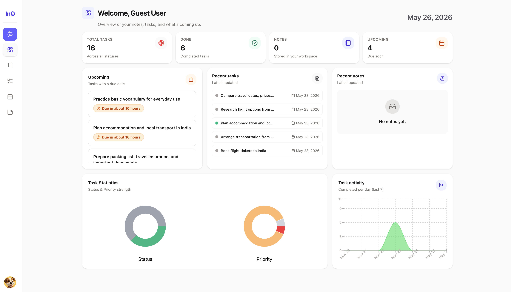

# InQueue

## Overview

InQueue is a task management application that allows users to organize their tasks efficiently. The app supports both guest and authenticated user experiences, with a focus on a seamless and intuitive interface.

# Screenshots



## Authentication Architecture Plan

### Current Auth Flows

1. **Guest Login** - API call to get a guest user and token, then user can access the app
2. **Atlas Login** - App redirects to Atlas login page, receives authorization code in URL, API call to exchange code for token and user data

### Professional Auth Architecture

#### 1. Single Source of Truth with Zustand Store

**Current Issue:** Mixed usage of `useAuth` hook and `useAuthStore` creates inconsistency.

**Solution:** Use `useAuthStore` as the single source of truth for all auth state.

```typescript
// useAuthStore should manage:
- user: IUser | null
- token: string | null
- isAuthenticated: boolean
- authType: 'guest' | 'atlas' | null
- loading: boolean
- error: string | null
```

#### 2. Auth Context for Global Access

Create an `AuthProvider` component to wrap the app and provide auth context:

```typescript
// src/context/AuthContext.tsx
- Provides auth state and actions to entire app
- Handles token refresh logic
- Manages session persistence
- Centralizes auth-related side effects
```

#### 3. Auth Service Layer

Separate business logic from state management:

```typescript
// src/services/authService.ts
- guestLogin()
- atlasLogin(code: string)
- logout()
- refreshToken()
- validateToken()
- switchAuthType(from: 'guest' | 'atlas', to: 'guest' | 'atlas')
```

#### 4. Protected Routes with Loading States

Enhance `ProtectedRoute` component to handle:

- Loading states during auth checks
- Redirect logic based on auth type
- Token validation before route access
- Session expiration handling

#### 5. Token Management Strategy

**Storage:** Use secure storage with fallback
- Primary: httpOnly cookie (if backend supports)
- Fallback: localStorage with encryption
- Memory: For sensitive operations

**Token Refresh:**
- Implement automatic token refresh
- Handle token expiration gracefully
- Queue requests during refresh

#### 6. Auth State Persistence

**Initialization Flow:**
1. App loads → Check localStorage for token
2. Validate token with backend
3. If valid → Restore session, set auth type
4. If invalid → Clear storage, redirect to login

**Session Sync:**
- Sync auth state across tabs using storage events
- Handle logout from other tabs

#### 7. Error Handling & Recovery

**Auth Errors:**
- Network errors during login
- Invalid credentials
- Token expiration
- Session conflicts (guest → atlas switch)

**Recovery Strategies:**
- Retry logic for network failures
- Clear error messages for users
- Automatic logout on critical errors
- Graceful degradation

#### 8. Type Safety

Define strict TypeScript types for auth:

```typescript
// src/types/auth.types.ts
interface AuthState {
  user: IUser | null;
  token: string | null;
  authType: 'guest' | 'atlas' | null;
  isAuthenticated: boolean;
  loading: boolean;
}

interface AuthActions {
  login: (credentials: LoginCredentials) => Promise<void>;
  logout: () => void;
  switchAuth: (newType: 'guest' | 'atlas') => Promise<void>;
}
```

#### 9. Migration Path

**Phase 1:** Consolidate to single auth store
- Remove `useAuth` hook
- Update all components to use `useAuthStore`
- Add auth type tracking

**Phase 2:** Implement auth service layer
- Extract API calls to authService
- Add error handling
- Implement token refresh

**Phase 3:** Add AuthContext
- Create AuthProvider
- Wrap app with provider
- Migrate components to use context

**Phase 4:** Enhance protected routes
- Improve loading states
- Add token validation
- Handle session expiration

#### 10. Security Best Practices

- Never store tokens in plain localStorage (use encryption)
- Implement CSRF protection
- Use short-lived tokens with refresh mechanism
- Sanitize user data before storage
- Implement rate limiting for auth endpoints
- Log auth events for audit trail

> **Note on "encryption":** client-side encryption of localStorage tokens doesn't meaningfully stop XSS — any script that can read the encrypted value can also reach the decryption key/routine sitting in the same bundle. The actual mitigation is moving `access_token`/`refresh_token` out of JS-readable storage entirely, i.e. httpOnly, `SameSite` cookies set by the auth backend (`authAxios` already sends `withCredentials: true`, so the backend side is the only missing piece). That's a backend change, not something fixable from this repo alone — tracked here so it isn't lost as a frontend TODO.

#### 11. Testing Strategy

**Unit Tests:**
- Auth store actions and selectors
- Auth service methods
- Token validation logic

**Integration Tests:**
- Login flows (guest and atlas)
- Protected route behavior
- Token refresh mechanism
- Auth state persistence

**E2E Tests:**
- Complete user journeys
- Tab synchronization
- Error recovery scenarios

### Implementation Priority

1. **High Priority:** Consolidate auth to single store, add auth type tracking
2. **High Priority:** Implement auth service layer with proper error handling
3. **Medium Priority:** Add AuthContext for global access
4. **Medium Priority:** Enhance protected routes with loading states
5. **Low Priority:** Implement token refresh mechanism
6. **Low Priority:** Add advanced security features
