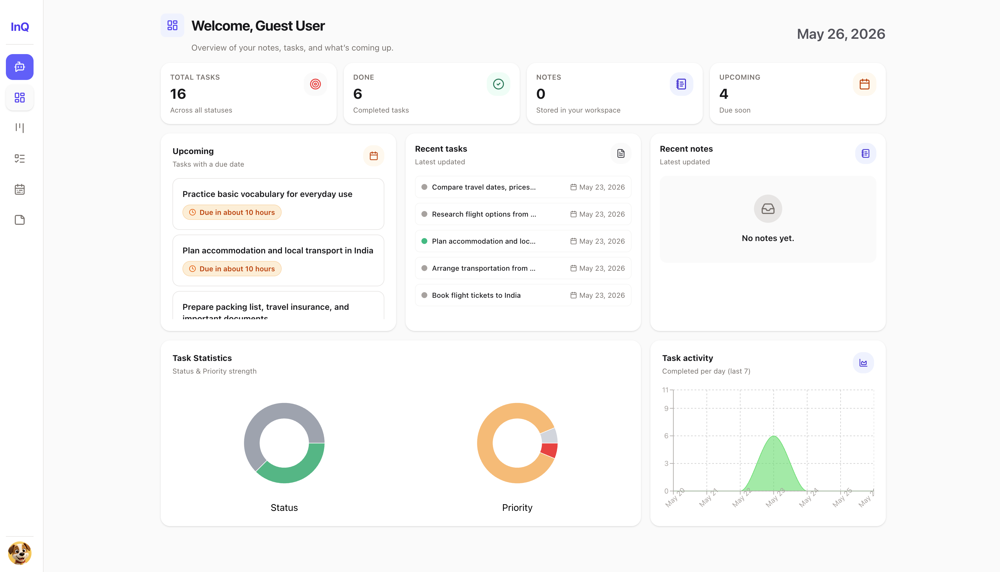

# InQueue

[](https://github.com/kashyapkrlucky/inqueue/actions/workflows/ci.yml)


[](LICENSE)

A task manager with a Kanban board, a calendar view, labels, and an AI
assistant — built as a React 19 + TypeScript SPA with a feature-based
architecture, httpOnly-cookie auth, and a CI pipeline covering lint,
formatting, types, unit tests with a coverage floor, a bundle-size budget,
and end-to-end tests.



🎥 [Watch a short demo](./screens/InQueue.mp4)

## Features

- **Board view** — a Kanban board (To Do / In Progress / Done) with
  mouse drag-and-drop, a touch/pointer-based drag path for mobile, and a
  keyboard-operable "Move to…" fallback with live-region announcements for
  screen reader users.
- **Calendar & list views** — the same tasks, filterable by status/priority
  and searchable by title.
- **Labels & priorities** for organizing and filtering tasks.
- **"Ask Tia"** — an AI assistant panel for asking questions about your
  tasks.
- **Guest login or Atlas SSO** — try the app instantly as a guest, or sign in
  through Atlas ID (a companion auth service); see
  [docs/AUTH_ARCHITECTURE.md](./docs/AUTH_ARCHITECTURE.md) for how the
  session itself is secured (httpOnly cookies, rotating refresh tokens, a
  request queue that collapses concurrent 401s into one refresh).
- **Installable PWA** with an offline-capable app shell.

## Tech stack

React 19 · TypeScript · Vite 7 · Tailwind CSS 4 · Zustand · React Router 7 ·
Axios · Vitest + Testing Library · Playwright · ESLint + Prettier · Docker

## Getting started

InQueue is the frontend for a small set of services — it talks to a
companion **auth server** (atlas-id) and **api server** for everything
except the static UI itself, so `VITE_AUTH_URL`/`VITE_API_URL` need to point
at running instances of those (locally or hosted) before login/data actually
works.

```bash
npm install
cp .env.example .env   # fill in VITE_AUTH_URL / VITE_API_URL / VITE_CLIENT_ID
npm run dev             # http://localhost:5173
```

Other scripts:

```bash
npm run build            # typecheck + production build
npm run lint              # eslint
npm run format:check      # prettier --check
npm test                  # vitest, watch mode
npm run test:coverage     # vitest run --coverage (enforces the floor in vitest.config.ts)
npm run test:e2e          # playwright (mocks the backend — see e2e/README.md)
npm run size               # bundle-size budget check (post-build)
```

A pre-commit hook (husky + lint-staged) runs eslint and prettier on staged
files automatically.

### Docker

```bash
docker build \
  --build-arg VITE_AUTH_URL=http://localhost:3000 \
  --build-arg VITE_API_URL=http://localhost:3001 \
  --build-arg VITE_CLIENT_ID=your-client-id \
  -t inqueue .
docker run -p 8080:80 inqueue
```

`VITE_*` values are baked in at build time (that's how Vite works), so they're
build args, not container env vars. The image is a multi-stage build — Node
to build, nginx to serve — with SPA fallback routing, immutable caching for
hashed assets, and the same security headers as the Vercel deploy (see
below).

## Architecture

```
src/
  app/           # router, layout, error boundary
  features/      # one folder per domain: tasks, board, labels, auth, ...
    <feature>/
      components/
      pages/
      store/      # Zustand store for this feature
      types/
  shared/         # cross-feature UI components, utils, constants
  lib/            # axios instances, env validation
```

Each feature owns its own Zustand store rather than a single global store —
keeps state changes scoped to the feature that owns them, and means a
feature can be deleted by deleting its folder.

**Auth** is the one part of this app worth reading in detail beyond the code
itself — see [docs/AUTH_ARCHITECTURE.md](./docs/AUTH_ARCHITECTURE.md).

**CI** (`.github/workflows/ci.yml`) runs on every PR and push to `main`:
dependency audit → lint → format check → typecheck → unit tests with a
coverage floor → build → bundle-size budget → Playwright E2E.

## Engineering decisions & tradeoffs

A few choices that are more interesting than "we picked the popular option":

- **Zustand over Redux/Context** — each feature's state is genuinely
  independent (tasks don't need to know about label state, board state
  doesn't need global coordination), so a single global store with
  reducers/actions boilerplate would add ceremony without solving a real
  cross-feature coordination problem. Plain hooks backed by Context would
  work too, but Zustand's selector-based subscriptions avoid the
  re-render-everything-on-every-change problem Context has out of the box.
- **Auth in httpOnly cookies, not localStorage** — see
  [docs/AUTH_ARCHITECTURE.md](./docs/AUTH_ARCHITECTURE.md). This was a
  cross-repo change (the auth server had to start setting the cookies before
  the frontend could stop reading tokens from localStorage).
- **Manual Vite chunk splitting** (`vite.config.ts`) — React, the router,
  icons, and the rest of `node_modules` are split into separate vendor
  chunks so a change to app code doesn't invalidate the React/router chunk's
  cache, and vice versa. Backed by a `size-limit` budget per chunk in CI so
  a dependency bump that quietly doubles a chunk's size gets caught in
  review instead of in production.
- **E2E tests mock the backend at the network boundary** rather than
  requiring the auth/api servers to be running — CI has no way to reach
  them, and a shared dev database would make the suite flaky and
  order-dependent. The tradeoff (and how to add a real-backend variant
  alongside it) is written up in [e2e/README.md](./e2e/README.md).
- **Coverage and bundle-size thresholds are regression floors, not
  aspirational targets** — both are set just below what's currently
  measured, specifically so CI fails on a regression rather than on the
  (large, pre-existing) gap between current and ideal coverage. Worth
  raising incrementally as more of the component tree gets tests.

## Testing

- **Unit/component** (Vitest + Testing Library): stores, form validation,
  the board's drag-and-drop (mouse, touch/pointer, and the keyboard "Move
  to…" fallback), route-guarding logic. `npm run test:coverage` for a
  coverage report.
- **E2E** (Playwright): golden-path login → create-task flow, and the
  unauthenticated-redirect path. See [e2e/README.md](./e2e/README.md) for
  how the backend is mocked.

## Deployment

- **Vercel**: `vercel.json` has SPA rewrites and security headers (CSP,
  X-Frame-Options, Referrer-Policy, Permissions-Policy) configured — connect
  the repo and set the `VITE_*` env vars in the Vercel project settings.
- **Docker**: see [Docker](#docker) above, or use `Dockerfile/nginx.conf`
  directly with any container host.

## License

[MIT](./LICENSE)
